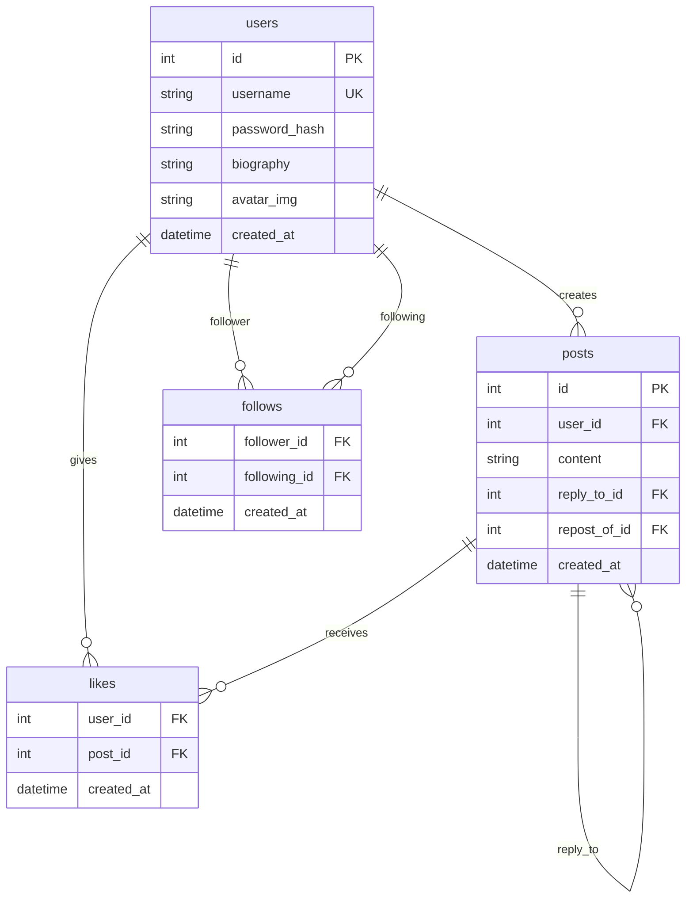

## セットアップ

```bash
# 仮想環境の作成
python -m venv venv
source venv/bin/activate

# 依存関係のインストール
pip install -r requirements.txt

# db用 dataディレクトリの追加
mkdir data

# サーバー起動
uvicorn app.main:app --reload
```

---

## ディレクトリ構成

```
kithub-sns-backend/
├── .gitignore
├── Makefile
├── README.md
├── requirements.txt
├── data/                      # DBファイル格納（git管理外）
└── app/
    ├── main.py                # FastAPIアプリケーションのエントリーポイント
    ├── api/
    │   ├── __init__.py
    │   └── endpoints/
    │       ├── posts.py       # 投稿関連のエンドポイント
    │       └── users.py       # ユーザー関連のエンドポイント
    ├── core/
    │   ├── conf.py            # 設定値
    │   ├── dependencies.py    # 依存性注入（認証など）
    │   └── password.py        # パスワードハッシュ化
    ├── crud/
    │   ├── __init__.py
    │   ├── posts.py           # postsテーブルのCRUD操作
    │   └── users.py           # usersテーブルのCRUD操作
    ├── db/
    │   ├── database.py        # DBテーブル作成
    │   └── session.py         # DBセッション管理
    └── schemas/
        ├── __init__.py
        ├── posts.py           # 投稿のリクエスト/レスポンススキーマ
        └── users.py           # ユーザーのリクエスト/レスポンススキーマ
```

---

## API仕様

### 認証

リクエストヘッダーに `User-name` を設定：

```
User-name: <username>
```

> 将来的には `Authorization: Bearer <token>` に置き換え予定

---

### Users API

#### POST `/users/signup` - ユーザー登録

| 項目       | 値          |
| ---------- | ----------- |
| 認証       | 不要        |
| ステータス | 201 Created |

**リクエスト:**

```json
{
  "username": "string",
  "password": "string"
}
```

**レスポンス:**

```json
{
  "username": "string"
}
```

---

#### POST `/users/login` - ログイン

| 項目       | 値     |
| ---------- | ------ |
| 認証       | 不要   |
| ステータス | 200 OK |

**リクエスト:**

```json
{
  "username": "string",
  "password": "string"
}
```

**レスポンス:**

```json
{
  "username": "string"
}
```

---

#### POST `/users/logout` - ログアウト

| 項目       | 値             |
| ---------- | -------------- |
| 認証       | 必要           |
| ステータス | 204 No Content |

> 現在は何も処理を行いません（将来的にトークン無効化を実装予定）

---

#### GET `/users/{username}` - プロフィール取得

| 項目       | 値     |
| ---------- | ------ |
| 認証       | 必要   |
| ステータス | 200 OK |

**パスパラメータ:**

- `username`: ユーザー名

**レスポンス:**

```json
{
  "username": "string",
  "biography": "string",
  "avatar_img": "string",
  "created_at": "datetime"
}
```

---

#### PUT `/users/me` - プロフィール更新

| 項目       | 値     |
| ---------- | ------ |
| 認証       | 必要   |
| ステータス | 200 OK |

**リクエスト:**

```json
{
  "username": "string",
  "biography": "string",
  "avatar_img": "string"
}
```

**レスポンス:**

```json
{
  "username": "string",
  "biography": "string",
  "avatar_img": "string",
  "created_at": "datetime"
}
```

---

#### PUT `/users/me/password` - パスワード更新

| 項目       | 値             |
| ---------- | -------------- |
| 認証       | 必要           |
| ステータス | 204 No Content |

**リクエスト:**

```json
{
  "password": "string"
}
```

---

#### DELETE `/users/me` - アカウント削除

| 項目       | 値             |
| ---------- | -------------- |
| 認証       | 必要           |
| ステータス | 204 No Content |

---

### Posts API

#### POST `/posts/` - 投稿作成

| 項目       | 値          |
| ---------- | ----------- |
| 認証       | 必要        |
| ステータス | 201 Created |

**リクエスト:**

```json
{
  "content": "string",
  "reply_to_id": "int または null（省略可）",
  "repost_of_id": "int または null（省略可）"
}
```

| フィールド     | 型             | 必須 | 説明                                       |
| -------------- | -------------- | ---- | ------------------------------------------ |
| `content`      | string         | ✅   | 投稿内容                                   |
| `reply_to_id`  | int または null | ❌   | 返信先の投稿ID（通常の投稿なら省略または null） |
| `repost_of_id` | int または null | ❌   | リポスト元の投稿ID（通常の投稿なら省略または null） |

**レスポンス:** ResponsePost（下記参照）

---

#### GET `/posts/` - タイムライン取得

| 項目       | 値     |
| ---------- | ------ |
| 認証       | 必要   |
| ステータス | 200 OK |

**レスポンス:**

```json
{
  "posts": [ResponsePost],
  "total_posts": "int"
}
```

---

#### GET `/posts/{username}/posts` - ユーザーの投稿一覧取得

| 項目       | 値     |
| ---------- | ------ |
| 認証       | 必要   |
| ステータス | 200 OK |

**パスパラメータ:**

- `username`: ユーザー名

**レスポンス:**

```json
{
  "posts": [ResponsePost],
  "total_posts": "int"
}
```

---

#### GET `/posts/{post_id}` - 投稿取得

| 項目       | 値     |
| ---------- | ------ |
| 認証       | 必要   |
| ステータス | 200 OK |

**パスパラメータ:**

- `post_id`: 投稿ID

**レスポンス:** ResponsePost（下記参照）

---

#### GET `/posts/{post_id}/replies` - リプライ取得

| 項目       | 値     |
| ---------- | ------ |
| 認証       | 必要   |
| ステータス | 200 OK |

**パスパラメータ:**

- `post_id`: 投稿ID

**レスポンス:**

```json
{
  "posts": [ResponsePost],
  "total_posts": "int"
}
```

---

#### PUT `/posts/{post_id}` - 投稿更新

| 項目       | 値                     |
| ---------- | ---------------------- |
| 認証       | 必要（自分の投稿のみ） |
| ステータス | 200 OK                 |

**パスパラメータ:**

- `post_id`: 投稿ID

**リクエスト:**

```json
{
  "content": "string"
}
```

**レスポンス:** ResponsePost（下記参照）

---

#### DELETE `/posts/{post_id}` - 投稿削除

| 項目       | 値                     |
| ---------- | ---------------------- |
| 認証       | 必要（自分の投稿のみ） |
| ステータス | 204 No Content         |

**パスパラメータ:**

- `post_id`: 投稿ID

---

### 共通レスポンス型

#### ResponsePost

投稿の詳細情報を表すレスポンス型です。

```json
{
  "post_id": "int",
  "username": "string",
  "content": "string",
  "avatar_img": "string",
  "is_following": "boolean",
  "created_at": "datetime",
  "repost_count": "int または null",
  "like_count": "int または null",
  "reply_count": "int または null",
  "is_liked": "boolean または null",
  "repost_of_id": "int または null",
  "repost_of_content": "string または null",
  "reply_to_id": "int または null"
}
```

| フィールド         | 型                    | 説明                                             |
| ------------------ | --------------------- | ------------------------------------------------ |
| `post_id`          | int                   | 投稿の一意なID                                   |
| `username`         | string                | 投稿者のユーザー名                               |
| `content`          | string                | 投稿内容                                         |
| `avatar_img`       | string                | 投稿者のアバター画像URL                          |
| `is_following`     | boolean               | 投稿者をフォローしているか（※現在は常に `false`） |
| `created_at`       | datetime              | 投稿日時                                         |
| `repost_count`     | int または null       | リポストされた回数（なければ null）              |
| `like_count`       | int または null       | いいねの数（※現在は常に `0`）                    |
| `reply_count`      | int または null       | 返信の数（なければ null）                        |
| `is_liked`         | boolean または null   | 自分がいいねしたか（※現在は常に `false`）        |
| `repost_of_id`     | int または null       | リポスト元の投稿ID（リポストでなければ null）    |
| `repost_of_content`| string または null    | リポスト元の投稿内容（リポストでなければ null）  |
| `reply_to_id`      | int または null       | 返信先の投稿ID（返信でなければ null）            |


---

### Swagger UI

```
http://localhost:8000/docs
```

---

## 技術スタック

| カテゴリ       | 技術                            |
| -------------- | ------------------------------- |
| フレームワーク | FastAPI                         |
| データベース   | sqlite3（Python標準ライブラリ） |
| バリデーション | Pydantic v2                     |

---

## データベース設計


