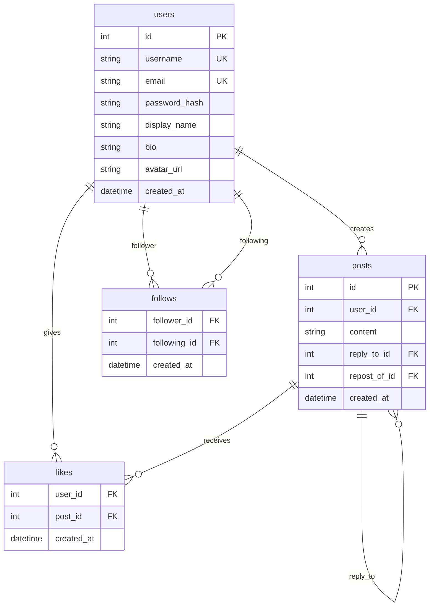

# Kithub SNS Backend

X (Twitter) 風の簡易SNSバックエンドAPI

---

## スコープ確定事項

| 項目             | 決定                                       |
| ---------------- | ------------------------------------------ |
| 認証             | 今は実装しないが、将来対応できる設計にする |
| 画像投稿         | 対象外                                     |
| リアルタイム通知 | 対象外                                     |
| CORS             | 最後に対応（フロントは後回し）             |

---

## 機能一覧（優先度順）

### ⭐⭐⭐ 最優先

| 機能           | 説明                 |
| -------------- | -------------------- |
| 投稿（ポスト） | テキスト投稿         |
| タイムライン   | 投稿一覧表示         |
| いいね         | 投稿へのリアクション |

### ⭐⭐ 優先

| 機能         | 説明             |
| ------------ | ---------------- |
| プロフィール | 表示名、自己紹介 |

### ⭐ 後回し

| 機能                  | 説明                |
| --------------------- | ------------------- |
| フォロー/アンフォロー | ユーザー間の関係性  |
| リポスト              | 投稿の再共有        |
| リプライ              | 投稿への返信        |
| 検索                  | ユーザー/投稿の検索 |

### 対象外

- 画像投稿
- 通知
- DM
- ブックマーク

---

## 開発フェーズ

### Phase 1: 基盤構築

- `app/db/database.py` - DB接続とヘルパー関数
- CREATE TABLE文でテーブル作成（users, posts, likes）
- テストデータ挿入

### Phase 2: コア機能

- 投稿機能（作成・取得・削除）
- タイムライン取得
- いいね機能

### Phase 3: ソーシャル機能（優先度低め）

- プロフィール表示・更新
- フォロー/アンフォロー
- リポスト
- リプライ

### Phase 4: 拡張

- 検索機能
- ページネーション
- CORS設定
- （将来）認証機能

---

## データベース設計



---

## API仕様

### 認証

リクエストヘッダーに `X-Username` を設定：

```
X-Username: <username>
```

> 将来的には `Authorization: Bearer <token>` に置き換え予定

---

### Users API

#### POST `/users/signup` - ユーザー登録

| 項目       | 値          |
| ---------- | ----------- |
| 認証       | 不要        |
| ステータス | 201 Created |

**リクエスト:**

```json
{
  "username": "string",
  "password": "string"
}
```

**レスポンス:**

```json
{
  "username": "string"
}
```

---

#### POST `/users/login` - ログイン

| 項目       | 値     |
| ---------- | ------ |
| 認証       | 不要   |
| ステータス | 200 OK |

**リクエスト:**

```json
{
  "username": "string",
  "password": "string"
}
```

**レスポンス:**

```json
{
  "username": "string"
}
```

---

#### GET `/users/{username}` - プロフィール取得

| 項目       | 値     |
| ---------- | ------ |
| 認証       | 必要   |
| ステータス | 200 OK |

**パスパラメータ:**

- `username`: ユーザー名

**レスポンス:**

```json
{
  "username": "string",
  "biography": "string",
  "avatar_img": "string",
  "created_at": "datetime"
}
```

---

#### PUT `/users/me` - プロフィール更新

| 項目       | 値     |
| ---------- | ------ |
| 認証       | 必要   |
| ステータス | 200 OK |

**リクエスト:**

```json
{
  "username": "string",
  "biography": "string",
  "avatar_img": "string"
}
```

**レスポンス:**

```json
{
  "username": "string",
  "biography": "string",
  "avatar_img": "string",
  "created_at": "datetime"
}
```

---

#### PUT `/users/me/password` - パスワード更新

| 項目       | 値             |
| ---------- | -------------- |
| 認証       | 必要           |
| ステータス | 204 No Content |

**リクエスト:**

```json
{
  "password": "string"
}
```

---

#### DELETE `/users/me` - アカウント削除

| 項目       | 値             |
| ---------- | -------------- |
| 認証       | 必要           |
| ステータス | 204 No Content |

---

### Posts API

#### POST `/posts/` - 投稿作成

| 項目       | 値          |
| ---------- | ----------- |
| 認証       | 必要        |
| ステータス | 201 Created |

**リクエスト:**

```json
{
  "content": "string",
  "reply_to_id": "int | null",
  "repost_of_id": "int | null"
}
```

**レスポンス:**

```json
{
  "post_id": "int",
  "username": "string",
  "content": "string",
  "avatar_img": "string",
  "created_at": "datetime",
  "reply_to_id": "int | null",
  "repost_of_id": "int | null",
  "repost_of_content": "string | null",
  "reply_count": "int",
  "repost_count": "int",
  "like_count": "int",
  "is_following": "boolean",
  "is_liked": "boolean"
}
```

---

#### GET `/posts/` - タイムライン取得

| 項目       | 値     |
| ---------- | ------ |
| 認証       | 必要   |
| ステータス | 200 OK |

**レスポンス:**

```json
{
  "posts": [ResponsePost],
  "total_posts": "int"
}
```

---

#### GET `/posts/{post_id}` - 投稿取得

| 項目       | 値     |
| ---------- | ------ |
| 認証       | 必要   |
| ステータス | 200 OK |

**パスパラメータ:**

- `post_id`: 投稿ID

---

#### GET `/posts/{post_id}/replies` - リプライ取得

| 項目       | 値     |
| ---------- | ------ |
| 認証       | 必要   |
| ステータス | 200 OK |

**パスパラメータ:**

- `post_id`: 投稿ID

**レスポンス:**

```json
{
  "posts": [ResponsePost],
  "total_posts": "int"
}
```

---

#### PUT `/posts/{post_id}` - 投稿更新

| 項目       | 値                     |
| ---------- | ---------------------- |
| 認証       | 必要（自分の投稿のみ） |
| ステータス | 200 OK                 |

**パスパラメータ:**

- `post_id`: 投稿ID

**リクエスト:**

```json
{
  "content": "string"
}
```

---

#### DELETE `/posts/{post_id}` - 投稿削除

| 項目       | 値                     |
| ---------- | ---------------------- |
| 認証       | 必要（自分の投稿のみ） |
| ステータス | 204 No Content         |

**パスパラメータ:**

- `post_id`: 投稿ID

---

### Swagger UI

```
http://localhost:8000/docs
```

---

## 技術スタック

| カテゴリ       | 技術                            |
| -------------- | ------------------------------- |
| フレームワーク | FastAPI                         |
| データベース   | sqlite3（Python標準ライブラリ） |
| バリデーション | Pydantic v2                     |

---

## セットアップ

```bash
# 仮想環境の作成
python -m venv venv
source venv/bin/activate

# 依存関係のインストール
pip install -r requirements.txt

# サーバー起動
uvicorn app.main:app --reload
```

## ライセンス

MIT
